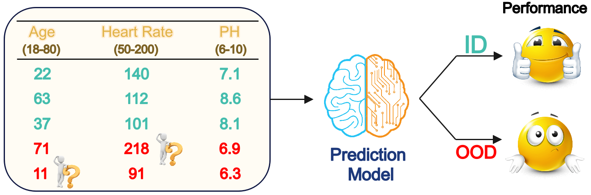
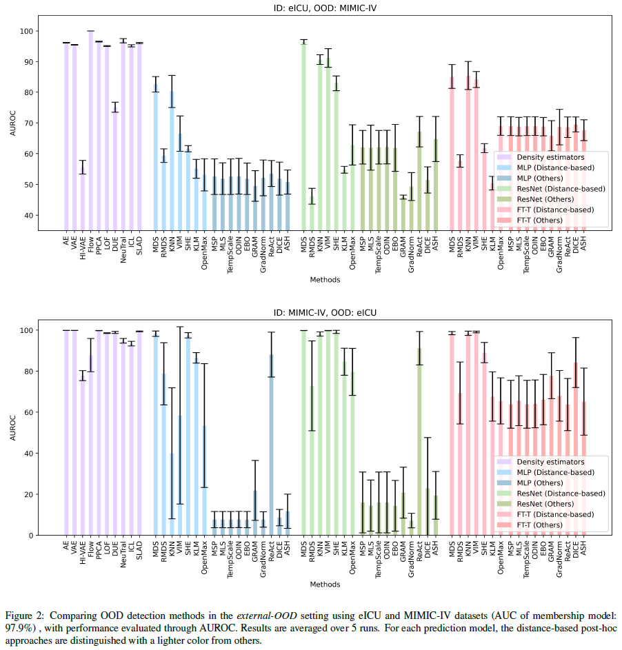

# A Benchmark for OOD Detection in Medical Tabular Data.
This repository contains the code for the paper "[Unmasking the Chameleons: A Benchmark for Out-of-Distribution Detection in Medical Tabular Data](https://arxiv.org/abs/2309.16220)". To reliably employ machine learning models in real-world healthcare systems and avoid inaccurate predictions on out-of-distribution (OOD) data, it is crucial to detect OOD samples. Numerous OOD detection approaches have been suggested in other fields - especially in computer vision - but it remains unclear whether the challenge is resolved when dealing with medical tabular data. To answer this pressing need, we propose an extensive reproducible benchmark to compare different methods across a suite of tests including both near and far OODs.

## Illustration
The practical dilemma of OOD data: there are no guarantees on how a model will perform on OOD data, hence real-time OOD detection becomes imperative.
<p align="center">
  
</p>

## Experimental Results
Three main settings are considered in the experiments, which are outlined as follows:
* `Far-OOD`: A different dataset than the in-distribution (ID) set is used as OOD.
* `Near-OOD`: A dataset is divided into ID/OOD sets based on the value of a feature.
* `Synthesized-OOD`: A feature from the ID set is scaled to construct OOD. By increasing the scaling factor, it looks like we are gradually transforming near-OOD samples into far-OOD ones. 
<p align="center">
  
</p>

## Downloading and Pre-processing Data
**eICU**: [Download](https://physionet.org/content/eicu-crd/)  [Pre-process](https://github.com/mostafaalishahi/eICU_Benchmark_updated)<br>
**MIMIC-III**: [Download](https://physionet.org/content/mimiciii/)  [Pre-process](https://github.com/MLforHealth/MIMIC_Extract)<br>
**MIMIC-IV**: [Download](https://physionet.org/content/mimiciv/)  [Pre-process](https://github.com/healthylaife/MIMIC-IV-Data-Pipeline)

Additionally, this [script](https://github.com/Pacmed/ehr_ood_detection/blob/master/src/preprocessing/eicu.py) offers an example of extracting features from time series data.<br>
The pre-processed CSV files should be placed in the top-level directory next to the `main.py` file.

## Code structure
The [main.py](main.py) is the top-level code, calling other functions provided in the subfolders for reading the data, defining the model, assigning OOD scores to the inputs, etc. In each of the subfolders, you will find the following code:
* [models](models)
  *   [predictive_models.py](models/predictive_models.py): The prediction models to which the post-hoc methods are applied. MLP, ResNet, and Transformer models are defined there.
  *   Others: The code for the density-based models, each defined in a separate py file.
* [ood_experiment](ood_experiment)
  * [experiments.py](ood_experiment/experiments.py): The code for defining the ID and OOD data according to the experiment type.
  * [validate_difference.py](ood_experiment/validate_difference.py): The code for measuring the difference between the ID and OOD sets based on Welch's t-test. 
* [ood_measures](ood_measures)
  * [detection_methods_posthoc.py](ood_measures/detection_methods_posthoc.py): The code for the post-hoc detection methods. All the post-hoc detectors are defined separately, and function `detection_method` calls each of them based on their name. The density-based models are similarly called in this function.
  * [ood_score.py](ood_measures/ood_score.py): The code for deploying and validating an OOD detector.
* [reading_files](reading_files)
  * [csv_read.py](reading_files/csv_read.py): The code for reading pre-processed data CSV files.
  * [feature_selection.py](reading_files/feature_selection.py): The code for selecting the desired rows and columns from data.
* [training](training)
  * [data_handler.py](training/data_handler.py): The code for normalizing the data and splitting it to train/val/test.
  * [train.py](training/train.py), [evaluate.py](training/evaluate.py): The code for training and evaluating the prediction models to which the post-hoc methods are applied.


## Running the Code

### Preliminaries
To run the code in [Google Colab](https://research.google.com/colaboratory/), you need to install the following libraries:
```
!pip install git+https://github.com/Jingkang50/OpenOOD
!pip install pytorch_lightning
!pip install gpytorch
!pip install --upgrade git+https://github.com/y0ast/DUE.git
!pip install nflows
```

### Main code options
The options for the training and evaluation code are as follows:

* `in_distribution`: The dataset employed as the  in-distribution set in the experiments, yet only a portion of it might be utilized based on the experiment type.
* `ood_type`: The type of OOD samples in the experiment. {`other_domain`: Equivalent to the far-OOD setting. `multiplication`: Equivalent to the synthesized-OOD setting. `feature_seperation`: Equivalent to the near-OOD setting.}
* `detectors`: The detection methods included in the experiment.
* `architecture`: The prediction model's structure to which post-hoc methods are applied.

### Running command
```
python main.py --detectors 'MDS' 'AE' --in_distribution mimic --ood_type other_domain --architecture MLP
```

## Acknowledgement
Part of this code is inspired by [Trust Issues](https://github.com/Pacmed/ehr_ood_detection/), [Guidlines for Practical Evaluation](https://github.com/Giovannicina/selecting_OOD_detector), and [OpenOOD](https://github.com/Jingkang50/OpenOOD).

## Citation 
Please cite our work if you use the codebase: 
```
@article{
azizmalayeri2023unmasking,
title={Unmasking the Chameleons: A Benchmark for Out-of-Distribution Detection in Medical Tabular Data},
author={Mohammad Azizmalayeri and Ameen Abu-Hanna and Giovanni Cina},
journal={arXiv preprint arXiv:2309.16220},
year={2023},
}
```
